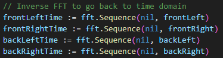

# Quadriphonic SQdecoder in less than 300 lines of golang : Part 3

This part follows part 1 and part 2 from Quadriphonic SQDecoder from my previous article.

# part 3 : Digital SQ Decoding

Unlike the analog part 2 which was a continuous processing, we are in discrete processing here.

The idea here is to use Fast Fourier Transform (FFT) because it speeds up processing  which is essential for handling large data sets efficiently.


*(made with Archi)*

We go back and forth between the time domain and the frequency domain.

*(1) back to the frequency domain*


*(2) we calculate quietly in the frequency domaine*

```
// SQ decoding with Fast Fourier Transform (FFT) in the frequency domain

FFT(lf) = FFT(LT) 
FFT(rf) = FFT(RT)

FFT(lb) := j*alpha*FFT(LT) - alpha*FFT(RT) = -alpha * (FFT(RT) - j*FFT(LT))
FFT(rb) := alpha*FFT(LT) - j*alpha*FFT(RT) = alpha * (FFT(LT) - j*FFT(RT))
```

*What translates "word for word" to Golang :*


*(3) and go back to the time domain*



I pushed one short quadraphonic demo file into the project. 

Command is as follows :


We then get 2 stereo files (in wave format) that correspond to the front and back channels.

You can listen with stereo headphones to the difference between the front and back stereo signals (but unfortunately not at the same time).

You can see the difference between the front and back signals under Audacity.


*front stereo channels lf and rf*


*back stereo channels lb and rb*

to be continued...


# sources


"Analog and Hybrid Computer Programmming" : from Bernd Ulmann (De Gruyter OldenBourg 2nd Edition)

"Science et Vie n°655 : Avril 1972 " : "Quadraphonie ..." from Roger Bellone

*you will note that the french term used in 1972 is quadraphonie and not quadriphonie*

"Science et Vie N°4 hors-série 1976 " : "La tétraphonie n'est pas un gadget" page 114 from Gérard Rainguez

*you will note that the french term used is tetraphonie and not quadriphonie*

"Encyclopédie illustrée de l'image et du son" from Zdeneck Krecan: Gründ : 1980 : ISBN 2-7000-1305-0

*In this book you will find a description of the _dual-head_ phonograph exhibited in the National Technical Museum of Prague.*

"Initiation Hi-Fi stereophonie/quadriphonie : S.E.C.F - Editions radio" from Pierre Chauvigny  : 1980 : ISBN-2-7091-0820-8

About Quadraphonic Systems (and Poincaré Sphere): https://midimagic.sgc-hosting.com/quadrafon.htm

About Quadraphonic Matrix Math : https://midimagic.sgc-hosting.com/quadmath.htm

About SQ :  https://www.4channelsound.com/encode.htm


